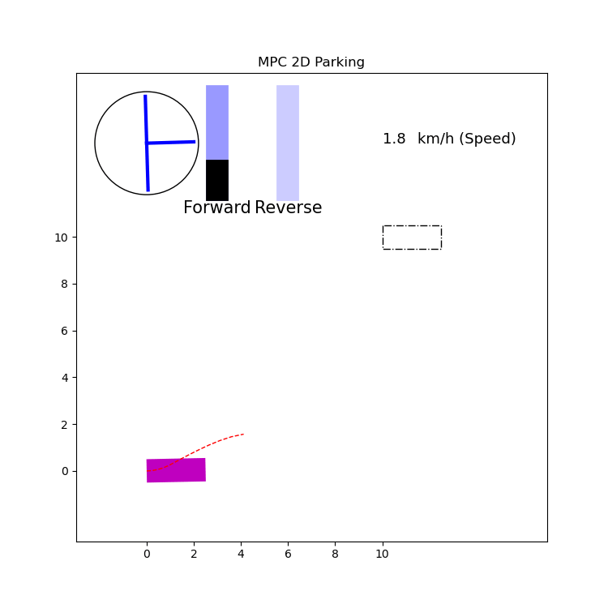
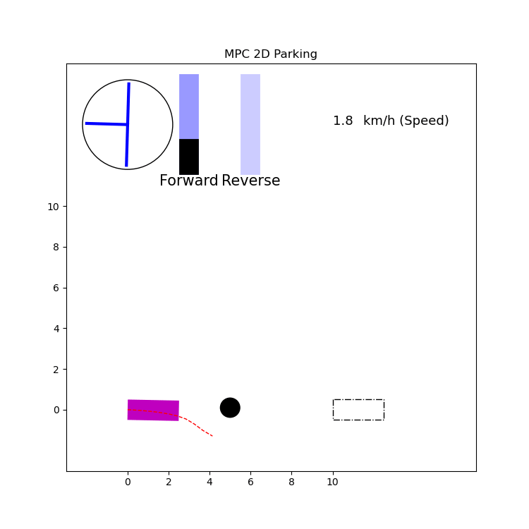

# Model Predictive Control (MPC) for Self-Driving Car
We are implementing a model predictive controller to move and park the self-driving car to the destination position. The control signals are gas pedal, brake pedal and steering wheels.  
If unexpected obstacles existing along the path, the car needs to avoid hitting the obstacle when planning the trajectory to follow. 

Run the "mpc_2d.py", you can get the following demonstration.

Run the "mpc_avoid_obstacle.py", you can get the following demonstration, where the black circle represents the obstacle.

